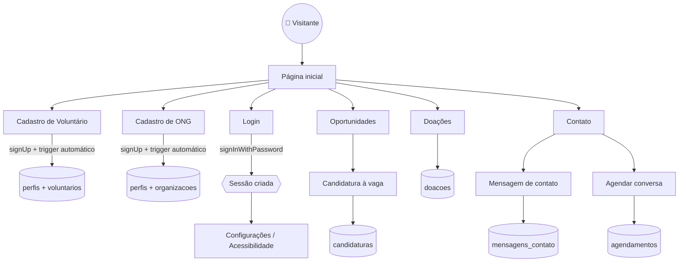

# Tô de Voluntário

Site social que conecta **voluntários** e **ONGs**: cadastro de voluntários, publicação de oportunidades, doações e contato. Construído em HTML/CSS/JS puro (sem build), com Bootstrap 5 para componentes/ícones e Supabase como banco de dados e autenticação.

## Tecnologias

- **HTML/CSS/JS** puro, sem framework ou bundler
- **Bootstrap 5** + **Bootstrap Icons** (via CDN)
- **Supabase** (PostgreSQL + Auth) para cadastro, login, oportunidades, candidaturas, doações e contato
- **VLibras** (widget oficial do governo) para tradução em Libras
- **API do IBGE** para a lista real de estados e cidades

## Estrutura de pastas

```
assets/
  css/style.css          - estilos do site
  js/script.js           - menu lateral, abas de Configurações, estados/cidades (IBGE)
  js/acessibilidade.js   - painel de acessibilidade, filtros de daltonismo, VLibras
  js/supabase-client.js  - inicializa o cliente do Supabase (chave anon, pública)
paginas/*.html           - todas as páginas do site, exceto a Home (index.html)
supabase/migrations/*.sql - schema completo do banco de dados
documentacao/*.pdf        - relatórios técnico e não técnico do projeto
.env.example              - variáveis de ambiente esperadas (copiar para .env)
```

## Fluxo do sistema



## Acessibilidade

Disponível em um botão flutuante em todas as páginas:

- Leitor de tela: skip-link, `label`/`for` em todos os formulários, `alt` em imagens, navegação 100% por teclado
- **Libras**: tradutor oficial do governo (VLibras) em todas as páginas
- Alto contraste, modo escuro, tamanho de fonte e espaçamento entre linhas
- 4 modos de ajuste de cor para daltonismo (protanopia, deuteranopia, tritanopia, acromatopsia)

## Banco de dados (Supabase)

Schema completo em [`supabase/migrations/20260812000000_criar_estrutura_completa.sql`](supabase/migrations/20260812000000_criar_estrutura_completa.sql) — 11 tabelas com chaves estrangeiras, índices e Row Level Security em todas elas:

`perfis`, `voluntarios`, `organizacoes`, `causas`, `habilidades`, `oportunidades`, `oportunidade_habilidades`, `candidaturas`, `doacoes`, `mensagens_contato`, `agendamentos`.

Um trigger em `auth.users` cria automaticamente o perfil (e os dados de voluntário) assim que alguém se cadastra, usando os dados enviados em `auth.signUp(..., { options: { data } })`.

## Rodando localmente

```bash
python3 -m http.server 8935
# abrir http://localhost:8935/index.html
```

## Configurando o Supabase

1. Copie `.env.example` para `.env` e preencha com as chaves do seu projeto (Project Settings → API).
2. Rode a migration em `supabase/migrations/` no SQL Editor do Supabase.
3. Preencha `SUPABASE_URL` e `SUPABASE_ANON_KEY` em `assets/js/supabase-client.js` (a chave anon é pública por design — a segurança vem do RLS do banco). **Nunca** use a chave `service_role`/`secret` no front-end.

## Histórico de mudanças

| Commit | O que foi feito |
|---|---|
| `b4f14b1` | Primeiro protótipo do site |
| `edac036` | Reorganiza estrutura de pastas (`assets/css`, `assets/js`) e cria o módulo central de acessibilidade (`acessibilidade.js`): tema, contraste, fonte, espaçamento, daltonismo e VLibras. Troca a lista fixa de estados pela API do IBGE. |
| `9665c93` | Adiciona Bootstrap 5 + Bootstrap Icons e acessibilidade completa nas 9 páginas (skip-link, ícones no lugar de emoji, labels corrigidos, alt em imagens). Conecta os formulários de cadastro, login e contato ao Supabase. |
| `f983469` | Prepara o ambiente do Supabase: `.env.example`, `.gitignore` e `assets/js/supabase-client.js`. |
| `d87108d` | Cria o schema completo do banco de dados (11 tabelas, RLS, trigger de cadastro automático). Testado ponta a ponta via API, incluindo casos que devem falhar. |
| `f718ab6` | Adiciona os relatórios de documentação (técnico e não técnico) em PDF. |
